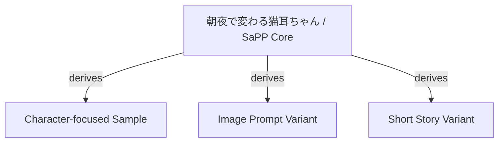
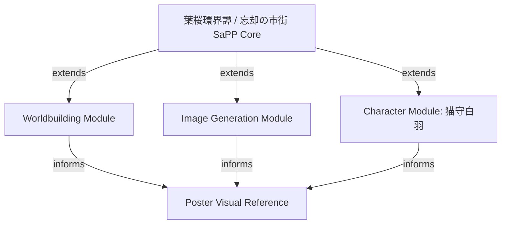

# Derivation Map

Derivation Map is a lightweight way to show how settings branch from one another. It may also show card composition when a sample is split into Core and Optional Modules, but derivative branches and composition links should be labeled differently.

It is not required to use SaPP.

## Minimal Example

```text
Original Setting
├─ Derivative A: changed season and setting
├─ Derivative B: changed medium from image prompt to short story
└─ Derivative C: kept core rules, changed character role
```

## What To Track

- Source setting
- Derivative setting
- What changed
- What stayed
- Credit link

## Mermaid Example



## Hazakura Kankaitan Sample Map



This map uses only the public sample cards in [examples/hazakura-kankaitan](../examples/hazakura-kankaitan/README.md). It does not imply that unpublished source material is available for reuse.

Use `derives` when a new setting or card changes a source. Use `extends` when an optional module adds detail to the same sample. Use `informs` when a card guides an asset, prompt, or reference.

For an actual derivative, keep the map small and pair it with a [Derivation Card](../templates/derivation-card.md).
