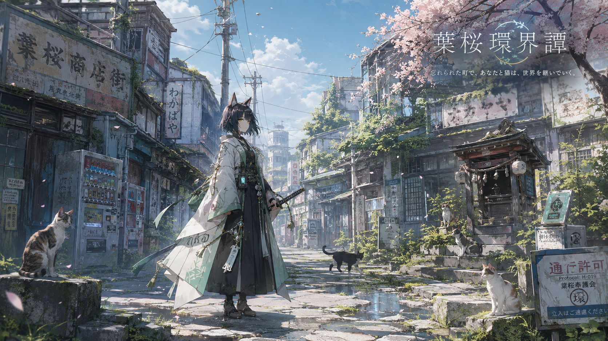

# Image Generation Module: 葉桜環界譚 / 忘却の市街



## Visual Keywords

- anime-style fantasy action RPG concept art
- old Japanese shopping street
- overgrown town
- weathered storefronts
- vending machines
- utility wires
- small roadside shrine
- cats
- pale green and white garments
- leaf-vein and circuit motifs
- subtle protocol technology
- spring-to-early-summer palette

## Composition

16:9 の横長構図が合う。

街路を奥へ抜ける導線を作り、左右に古い商店、看板、自販機、祠、猫を置く。人物は中央から少し外し、世界そのものが主役に見えるようにする。

## Mood

美しい。静か。少し怖い。けれど、まだ歩きたくなる。

暗いホラーではなく、明るい空、若葉、生活の痕跡、無人の違和感で不穏さを出す。

## Prompt Notes

```text
Create a 16:9 anime-style concept art scene for the original game world "葉桜環界譚". Show a quiet, worn-down Japanese shopping street in daylight, partially reclaimed by greenery. Include weathered storefronts, old signs, utility wires, cracked pavement, puddles, vending machines, broken protocol terminals, a small roadside shrine, scattered green leaves and weeds, and several cats. Add one calm cat-eared female swordswoman or observer-like traveler in pale green, white, gray-blue, and black layered clothing, with subtle shrine and protocol motifs. Mood: beautiful, calm, lonely, slightly uncanny, spring-to-early-summer. Use restrained effects and environmental storytelling.
```

## Negative Constraints

- 過度なネオン
- 血やグロテスク表現の強調
- 暗すぎるダークファンタジー
- 派手な魔法爆発
- メイド服的な猫耳表現
- あざとすぎるマスコット感
- SFメカを前面に出しすぎる表現

## Example Prompts

```text
Original anime-style fantasy action RPG key visual for "葉桜環界譚", a beautiful quiet overgrown Japanese shopping street after spring, old signs, vending machines, utility wires, small shrine, cats, subtle protocol technology, pale green and white motifs, blue sky, soft sunlight, delicate linework, calm lonely uncanny mood, no combat, restrained effects.
```
