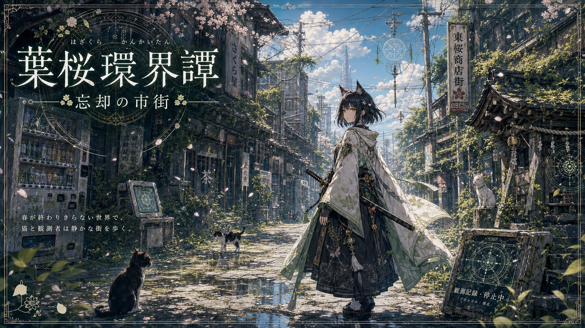

# Image-Generation-Focused Sample: 葉桜環界譚 Poster Brief

This sample shows how a SaPP setting card can become an image-generation brief.

It is based only on the public Hazakura Kankaitan SaPP sample cards:

- [SaPP Core](../hazakura-kankaitan/001-border-town-core.md)
- [Worldbuilding Module](../hazakura-kankaitan/002-border-town-worldbuilding-module.md)
- [Image Generation Module](../hazakura-kankaitan/003-border-town-image-generation-module.md)
- [Character Module](../hazakura-kankaitan/004-nekomori-shiraha-character-module.md)

## Goal

Create a poster-like visual reference for a SaPP sample, not a canonical character sheet or final key visual.

## What To Preserve

- Title: 葉桜環界譚
- Place: 忘却の市街
- Mood: beautiful, calm, lonely, slightly uncanny
- Setting: an old Japanese shopping street reclaimed by greenery
- Motifs: cats, small shrine, vending machines, old signs, utility wires, subtle circular protocol interfaces
- Public boundary: no unpublished settings, core story details, or unpublished characters

## What Can Change

- Camera angle
- Lighting
- Season balance between spring and early summer
- Poster layout
- Number and placement of cats
- Whether the observer-like figure is centered or off-center
- Amount of decorative text or border design

## Prompt Used For Generated Sample

```text
Use case: stylized-concept
Asset type: SaPP sample poster visual reference
Primary request: Create a 16:9 anime-style poster for the original public SaPP sample setting "葉桜環界譚 / 忘却の市街".
Scene/backdrop: A quiet, worn-down Japanese shopping street in daylight, partially reclaimed by greenery. Include weathered storefronts, old signs, utility wires, cracked pavement, puddles, vending machines, small roadside shrine elements, broken but subtle protocol terminals, and several cats.
Subject: One calm observer-like traveler or cat-eared swordswoman seen in a restrained, non-canonical way. Pale green, white, gray-blue, and black layered clothing with subtle shrine and protocol motifs. The character should feel like a visual entry point, not a final official design.
Composition: Poster-like layout, cinematic 16:9, readable title area, environmental storytelling first, character slightly off-center or mid-ground, cats visible, soft depth.
Text: Include the Japanese title "葉桜環界譚" and subtitle "忘却の市街". Avoid adding unrelated names or extra lore text.
Mood: Beautiful, calm, lonely, slightly uncanny, spring-to-early-summer.
Style: Clean anime-style concept art, delicate linework, soft light, restrained effects, pale green and white accents, subtle circular protocol graphics.
Avoid: unpublished story details, unpublished characters, gore, heavy horror, excessive neon, flashy magic explosions, overly cute mascot style, final/canonical character-sheet presentation.
```

## Generated Sample



## Asset Notes

- Purpose: image-generation-focused SaPP example
- License: CC BY 4.0, unless otherwise noted
- Generated by: AI-generated sample from the prompt in this file
- Canonical status: non-canonical visual reference
- Boundary: based on public SaPP sample cards; does not include unpublished settings, core story details, or unpublished characters
